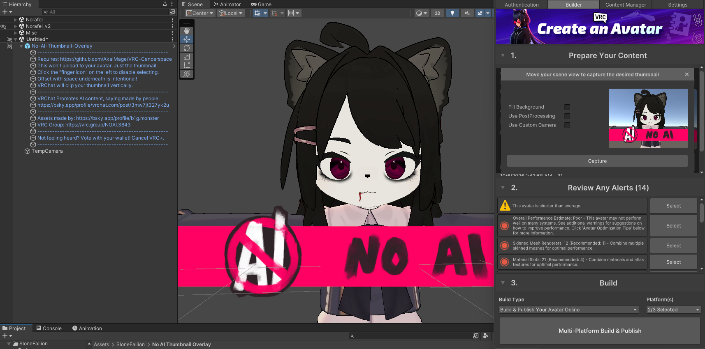

# No-AI-Thumbnail-Overlay
"No AI" Overlay for avatar pictures taken in the Unity editor.

# Usage:
- Requires import of the free [Cancerspace shader](https://github.com/AkaiMage/VRC-Cancerspace) (for overlay in the scene).
- Simply download the UnityPackage file and import the package into your project.
- Drag the prefab from `Assets/SloneFallion/No AI Thumbnail Overlay` into your scene.
- Use the SDK camera to take a screenshot.

# Credits:
- Assets: [big](https://bsky.app/profile/b1g.monster/post/3mwzctv2iys23)
- Distributed by [Purpzie](https://bsky.app/profile/purpzie.com/post/3mx5oof7qyc2f)

# Screenshot:

